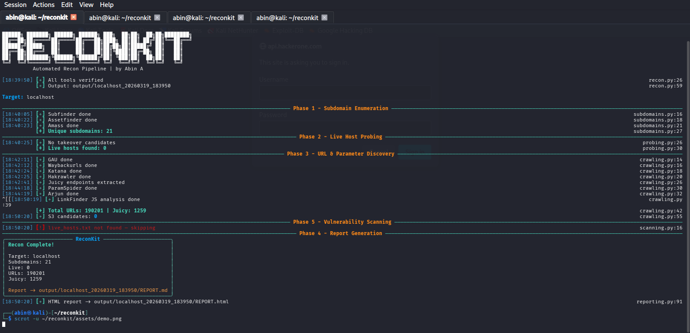

# ReconKit

> Automated Reconnaissance Pipeline for Bug Bounty & Penetration Testing

Built by **Abin A** — chains the best open-source recon tools into one automated pipeline with structured output, HTML reporting, and vulnerability scanning.

---

# Demo

> Run on hackerone.com with `--quick --skip-amass`
Target: hackerone.com
Subdomains: 34 | Live: 21 | URLs: 1,204 | Juicy: 47
Report -> output/hackerone.com_20260319/REPORT.html

---

# Pipeline

| Phase | Name | Tools |
|-------|------|-------|
| 1 | Subdomain Enumeration | Subfinder, Amass, Assetfinder |
| 2 | Live Host Probing | HTTPX, Takeover Detection |
| 3 | URL & Parameter Discovery | GAU, Waybackurls, Katana, Hakrawler |
| 4 | JS & Parameter Analysis | LinkFinder, ParamSpider, Arjun |
| 5 | Vulnerability Scanning | Nuclei (CVE, Misconfig, Exposure, Takeover) |
| 6 | Report Generation | Markdown + HTML report |

---

# Features

- **Subdomain takeover detection** — flags 404s on CNAMEs pointing to unclaimed services
- **S3 bucket candidates** — keyword filters across subdomains and URLs
- **Scope filtering** — accepts a scope file, strips out-of-scope targets before probing
- **Nuclei vuln scan** — CVE, misconfiguration, exposure, takeover templates
- **Dual reporting** — REPORT.md and color-coded REPORT.html per run
- **Tool preflight checks** — exits cleanly with a clear error if any tool is missing

---

# Installation

- git clone https://github.com/abinsolo/reconkit
- cd reconkit
- chmod +x install.sh && ./install.sh
- pip3 install -r requirements.txt --break-system-packages

---

# Requirements

- Kali Linux (recommended) or any Debian-based system
- Go 1.21+
- Python 3.10+

---

# Usage

## Full recon — all phases
python3 recon.py -d target.com

## Quick mode — subdomains + live hosts only
python3 recon.py -d target.com --quick

## Skip Amass (10x faster, slightly less coverage)
python3 recon.py -d target.com --skip-amass

## Skip JS analysis
python3 recon.py -d target.com --skip-js

## Skip Nuclei vulnerability scan
python3 recon.py -d target.com --skip-scan

## Fastest possible run
python3 recon.py -d target.com --quick --skip-amass

## With scope file (one domain per line)
python3 recon.py -d target.com --scope scope.txt

---

# Output Structure
Every run creates a timestamped folder under output/:
output/<domain>_<timestamp>/

 - all_subdomains.txt       - # Deduplicated subdomain list
 - live_hosts.txt           - # Live hosts with status codes
 - potential_takeover.txt   - # Subdomain takeover candidates
 - all_urls.txt             - # All discovered URLs
 - juicy_endpoints.txt      - # /api/, /graphql, /admin, /v1/, /v2/
 - s3_candidates.txt        - # S3 bucket candidates
 - params.txt               - # ParamSpider output
 - arjun_params.json        - # Hidden parameters (Arjun)
 - linkfinder_output.txt    - # JS endpoints
 - nuclei_findings.txt      - # Nuclei vulnerability findings
 - REPORT.md                - # Markdown report with next steps
 - REPORT.html              - # Color-coded HTML report

---

# Flag Reference

| Flag | Description |
|------|-------------|
| -d | Target domain (required) |
| --quick | Subdomains + live hosts only, skip crawling |
| --skip-amass | Skip Amass enumeration (much faster) |
| --skip-js | Skip LinkFinder JS analysis |
| --skip-scan | Skip Nuclei vulnerability scan |
| --scope | Path to scope file (one domain per line) |

---

# Next Steps After Each Run

- Review juicy_endpoints.txt for GraphQL introspection
- Check arjun_params.json for IDOR attack surface
- Investigate potential_takeover.txt candidates
- Check nuclei_findings.txt for CVEs and misconfigs
- Run s3_candidates.txt through S3Scanner manually
- Test auth endpoints with jwt_tool for JWT weaknesses

---

# Changelog

See CHANGELOG.md

| Version | Highlights |
|---------|------------|
| v1.2.0 | Nuclei scanning, takeover detection, S3 detection, scope flag, HTML report, CI |
| v1.1.0 | --skip-scan, --skip-js, --skip-amass flags |
| v1.0.0 | Initial release |

---

# Legal

Only use on targets you have explicit written permission to test.
This tool is built for authorized bug bounty programs and penetration testing engagements. Running this against systems without permission is illegal. The author takes no responsibility for misuse.

---

# Author

Abin A — Bug Bounty Researcher | Penetration Tester
- GitHub: github.com/abinsolo
- LinkedIn: linkedin.com/in/abin-a-937196382
- Platforms: HackerOne · Intigriti · YesWeHack

---

# Contributing

See CONTRIBUTING.md for guidelines on adding new modules.

---
